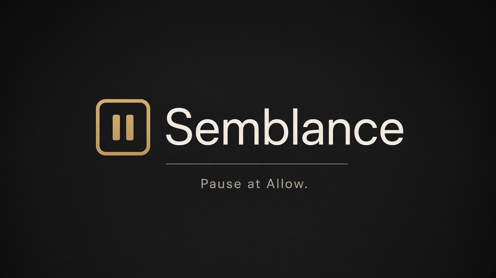
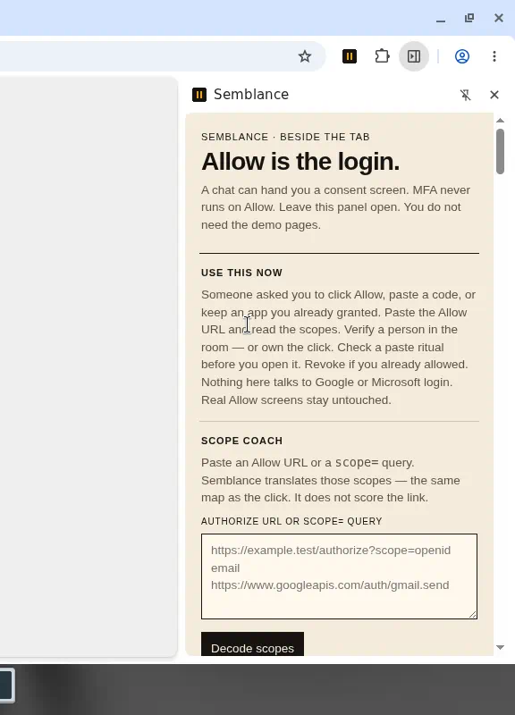
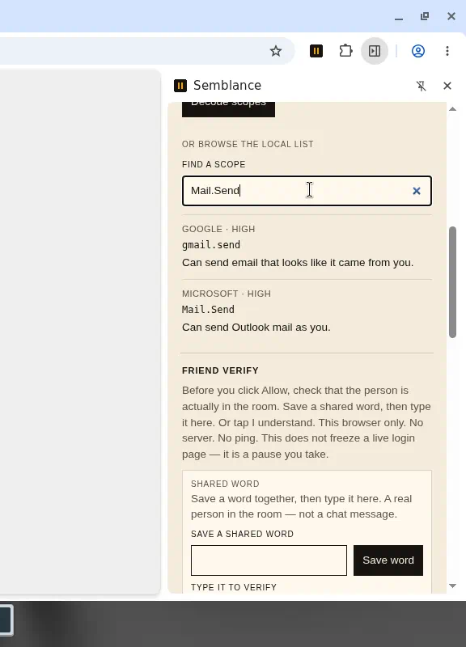
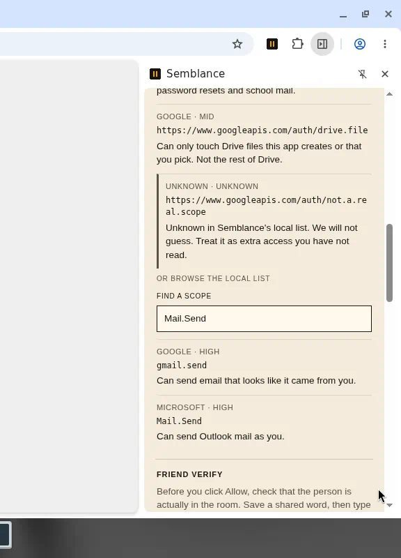
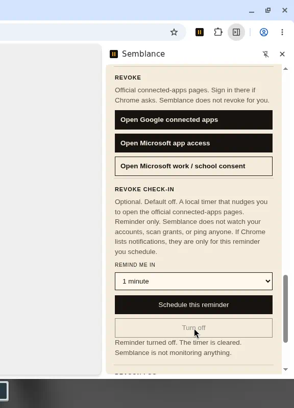
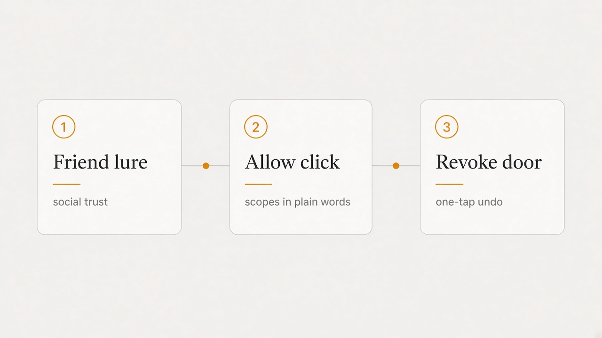

# Semblance

<p align="center">
  
</p>

OAuth **Allow** is the login. MFA never runs on that click, on **Continue with Google / Microsoft**, or on a device-login code. The breach is the consent handoff — a trust invite, a job or club form, a pasted `code=`, a device door, or high-risk scopes on an app you have not read. One coach for that family. Not five products.

Semblance sits beside the tab. When the address bar is an authorize URL, it reads `scope=` and the coach already has the plain-language map — Google and Microsoft consumer scopes from public docs, not an enterprise catalog. A device-login URL gets the same pause. Paste stays as fallback. Revoke stays one tap away after you already granted something.

## Install

Chrome **116+** (side panel). Load unpacked. No build step.

1. Clone or download this repo.
2. Open `chrome://extensions`.
3. Turn on **Developer mode**.
4. **Load unpacked** and pick this folder (the one with `manifest.json`).
5. Pin **Semblance**. Click the icon → **Open coach beside this tab**.

That panel is the product. You do not need the demo pages.

- Theater vs what stays installed: [AUTHENTICITY.md](AUTHENTICITY.md)
- Human load-unpacked pass: [SMOKE.md](SMOKE.md)

## Keep installed

Leave the coach open. Land on an Allow URL — badge `!`, open Semblance, scopes already decoded. You do not have to paste. A `…/devicelogin` or `google.com/device` tab is the same nudge: typing a code is Allow. Paste a `scope=` URL or a `code=` / localhost line when the tab is not already that door. Verify a person in the room, or **I understand**. Revoke through official Google and Microsoft pages. An optional check-in can nudge you later; it is off until you schedule it.

Semblance reads the address bar (`webNavigation` / tab URL). It does not inject into a live login host. It does not click Allow. It does not score the link.

<table>
  <tr>
    <td align="center" valign="top" width="50%">
      
      <br>
      <em>Beside the tab. You do not need the demo pages.</em>
    </td>
    <td align="center" valign="top" width="50%">
      
      <br>
      <em><code>Mail.Send</code> in one sentence. Friend-verify is the next card.</em>
    </td>
  </tr>
  <tr>
    <td align="center" valign="top" width="50%">
      
      <br>
      <em>Known tokens get a sentence. Unknown stays unknown. Not a link score.</em>
    </td>
    <td align="center" valign="top" width="50%">
      
      <br>
      <em>Official revoke pages. Check-in is <strong>off</strong> until you ask.</em>
    </td>
  </tr>
  <tr>
    <td align="center" valign="top" colspan="2">
      
      <br>
      <em>Schedule a nudge, then <strong>Turn off</strong>. A timer you asked for — not monitoring.</em>
    </td>
  </tr>
</table>

## Optional theater

Labeled **FAKE** only, behind **Demo only (labeled FAKE)** in the toolbar popup. LabQueue is a prop. The walkthrough is one story about the same click, not a live identity provider, and not the product door.

<p align="center">
  
  <br>
  <em>One story in the family. Not a live Allow screen.</em>
</p>

Beat B carries a sticky banner: **FAKE — not Google/Microsoft**. Allow still goes nowhere: no token, no network, no identity provider.

Close every demo tab. The side panel is still the product.

## Chrome Web Store

Load unpacked is enough to use Semblance. To pack a store zip (runtime files only):

```bash
node scripts/pack-store.mjs
```

Writes `dist/semblance-store.zip` — manifest, background, shared, popup, side panel, content, icons, and the labeled demo pages. Leaves out `docs/`, scripts, markdown, `.git`, and soak folders. The zip does not inject into a live identity provider.

- Listing draft (short + detailed copy, category, permissions, single purpose, screenshot upload order): [STORE.md](STORE.md)
- Privacy policy source: [PRIVACY.md](PRIVACY.md)
- Store screenshots (1280×800, upload order in STORE.md): [`docs/store/`](docs/store/)
- **Preferred** public privacy URL: https://arjun7n9s.github.io/Semblance/privacy/
- **Interim:** https://raw.githubusercontent.com/arjun7n9s/Semblance/main/PRIVACY.md

Chrome Web Store needs a **public HTTPS URL** for the privacy policy. `PRIVACY.md` is the source; `docs/privacy/index.html` is the public HTML copy. Enable GitHub Pages from **main** / **docs** (Settings → Pages → Deploy from a branch) if the preferred URL 404s. There is no separate Semblance privacy host.

## What we refuse

- No content scripts on `accounts.google.com`, Microsoft login, or any live identity provider
- No reading or exchanging codes, cookies, or tokens — address bar `scope=` only; `code=` stays a paste you chose
- No blocking or rewriting Allow, no declarativeNetRequest Allow-gate
- No Discord bot, no parent ping, no cloud on the critical path
- No URL “phishing score”
- No account scanning — the optional check-in is a local timer you schedule, not monitoring
- No five separate products and no SOC-museum dump of every enterprise scope
- Real Allow screens stay untouched. Use the coach and the official revoke links instead.

The content script, if it runs at all, may attach to the Semblance demo pages only (`demo/lure.html`, `demo/allow.html`).
