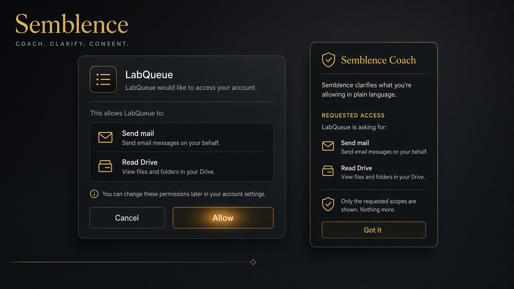
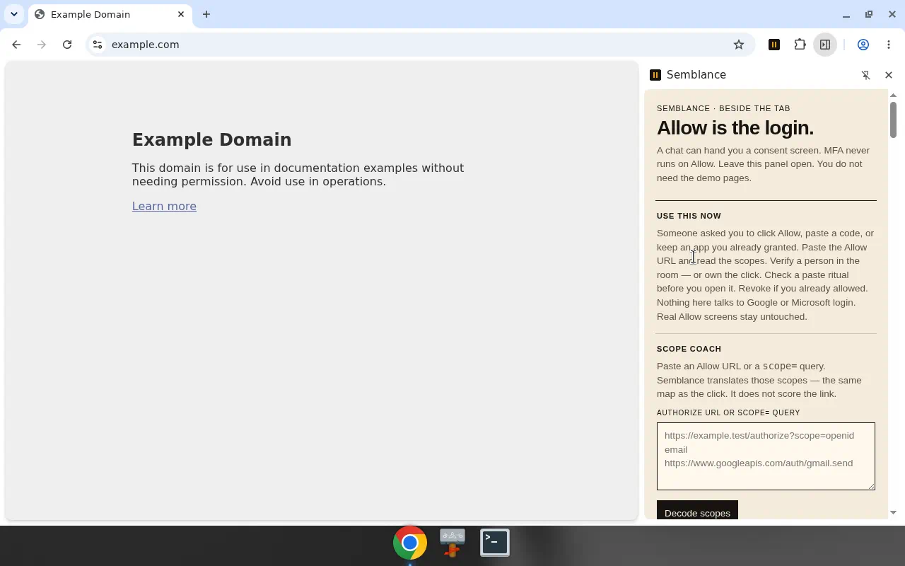
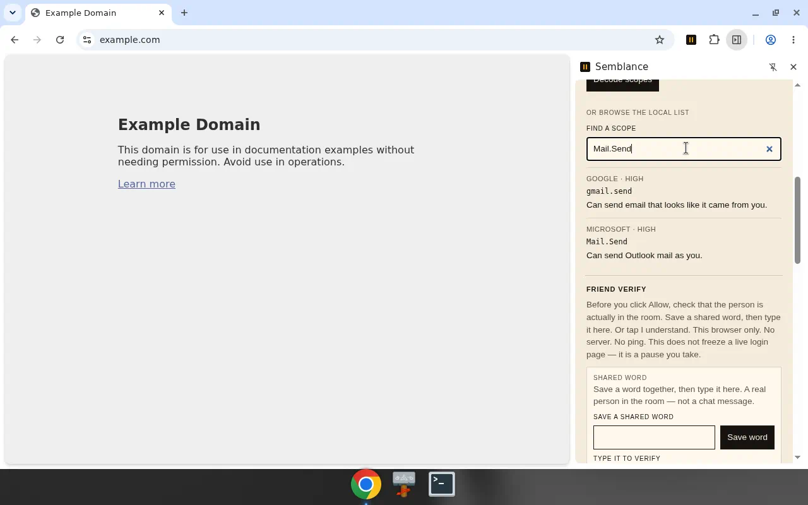
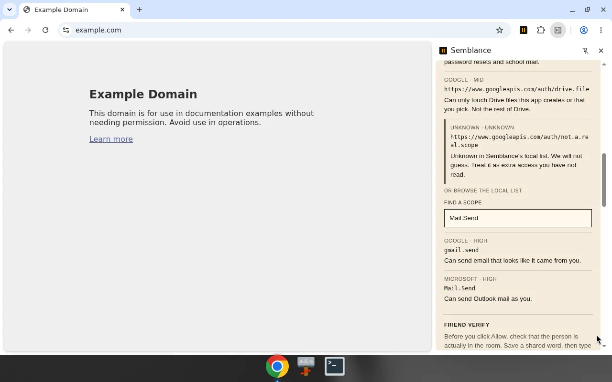
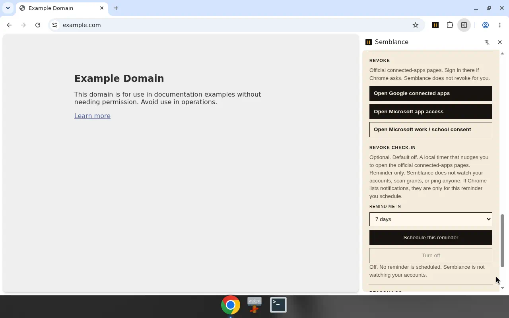
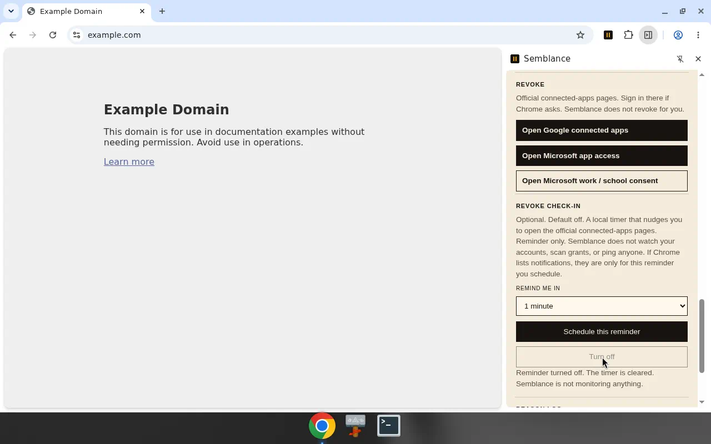

# Semblance

  

<em>Generated illustration — empty chrome, not a live Google or Microsoft Allow screen.</em>

A friend-shaped message is the trust fall. Then an OAuth **Allow** — and MFA never runs on that click. The Allow *is* the breach.

Semblance sits beside the tab, turns those scopes into ordinary sentences, and keeps a revoke door one tap away after you already granted something.

## Install

Chrome **116+** (side panel). Load unpacked. No build step.

1. Clone or download this repo.
2. Open `chrome://extensions`.
3. Turn on **Developer mode**.
4. **Load unpacked** and pick this folder (the one with `manifest.json`).
5. Pin **Semblance**. Click the icon → **Open coach beside this tab**.

That panel is the product. You do not need the demo pages.

- Theater vs what stays installed: [AUTHENTICITY.md](AUTHENTICITY.md)
- Human load-unpacked pass: [SMOKE.md](SMOKE.md)

## Keep installed

Leave the coach open next to chat. Paste an Allow URL or a `scope=` query. Read the scopes in plain language. Verify a person in the room — a shared word in this browser, or **I understand**. Revoke through official Google and Microsoft pages. An optional check-in can nudge you later; it is off until you schedule it.

Nothing in this panel talks to a live login host. Real Allow screens stay untouched.

  
   
  <em>The keep-installed coach, beside the tab. You do not need the demo pages.</em>

  
   
  <em>Search the local pack. <code>Mail.Send</code> is one sentence: this can send Outlook mail as you. Friend-verify is the next card — this browser only, no ping.</em>

  
   
  <em>Paste a <code>scope=</code> URL. Known tokens get a sentence. Unknown stays unknown. Semblance does not guess, and it does not score the link.</em>

  
   
  <em>Revoke opens official connected-apps pages. Semblance does not revoke for you. Check-in is optional and <strong>off</strong> until you ask.</em>

  
   
  <em>Schedule a later nudge, then <strong>Turn off</strong>. The timer is cleared. A reminder you asked for — not monitoring.</em>

## Optional theater

Labeled **FAKE** only. LabQueue is a prop. The walkthrough is a story about the same click, not a live identity provider.

  
   
  <em>Generated diagram. Friend lure → Allow click → revoke door. Not product chrome, and not a live Allow screen.</em>

From the toolbar popup, **Open Beat A · friend lure**. Maya’s chat cannot send. Follow **Open LabQueue** into Beat B.

Beat B is a consent card with a sticky banner:

**FAKE — not Google/Microsoft**

Semblance pauses once, then hard-stops a raw Allow. A shared word (saved in the side panel) or **I understand** opens the gate. Allow still goes nowhere: no token, no network, no identity provider.

Close every demo tab. The side panel is still the product.

## What we refuse

- No content scripts on `accounts.google.com`, Microsoft login, or any live identity provider
- No reading or exchanging codes, cookies, or tokens
- No Discord bot, no parent ping, no cloud on the critical path
- No URL “phishing score”
- No account scanning — the optional check-in is a local timer you schedule, not monitoring
- Real Allow screens stay untouched. Use the coach and the official revoke links instead.

The content script, if it runs at all, may attach to the Semblance demo pages only (`demo/lure.html`, `demo/allow.html`).
